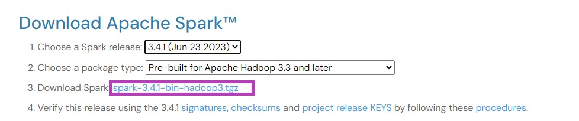
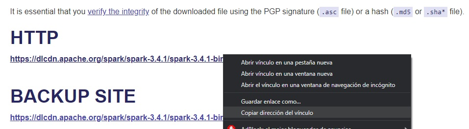
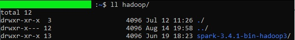
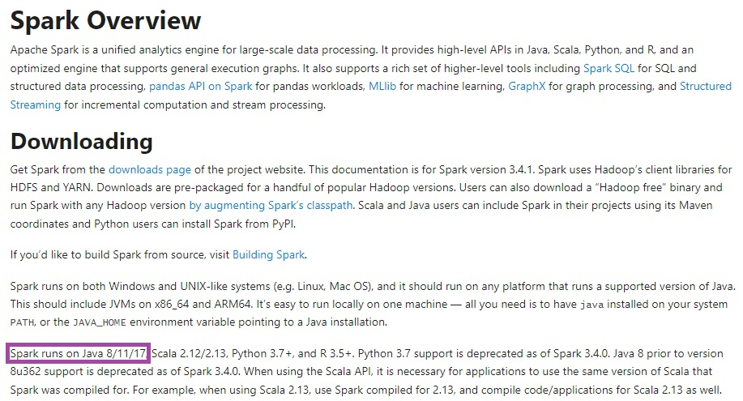
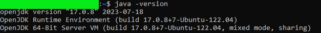
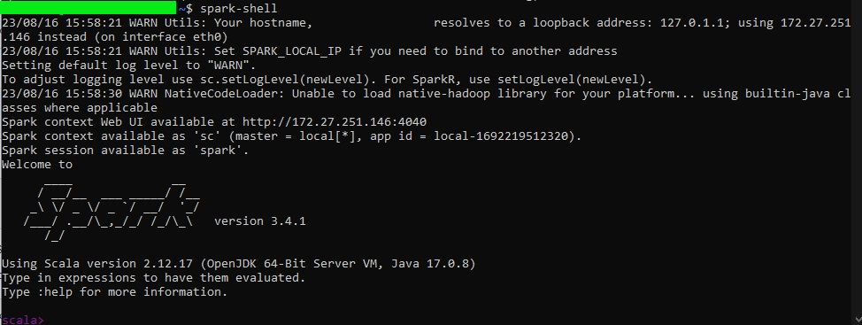

# Pyspark

In this repo you will find:

- How install pyspark
- scripts and examples using pyspark
- Spark's tips

## How install Pypark

### Downloading Spark

Spark can be downloaded from [https://spark.apache.org/downloads.html](https://spark.apache.org/downloads.html)

Select and click the below link



Get and copy the url file


Download by wget
```console
wget https://dlcdn.apache.org/spark/spark-3.4.1/spark-3.4.1-bin-hadoop3.tgz
```

### Installing Spark

We will create a folder named "hadoop" to install Spark there, using the following command:

```
mkdir hadoop
```

We will use the 'tar' command to extract the contents into the 'hadoop' folder the we previoulsy created

```
tar -xvzf ~/spark-3.4.1-bin-hadoop3.tgz -C ~/hadoop
```

We are going to verify that the files are decompressed, using below command



Add *SPARK_HOME* variable to enviroment variables and *PATH* variable using the following commands

```
export SPARK_HOME=~/hadoop/spark-3.4.1-bin-hadoop3
export PATH=$SPARK_HOME/bin:$PATH
```

### Installing Java (Mandatory Dependency)

To determine which Java version to download, you can go to the [url](https://spark.apache.org/docs/) and choose your version. In this case, the selected version tells me that the required Java is any of the following:



So, I decided to use java version 17. We will install java using following commands:

```
sudo apt update
sudo apt install openjdk-17-jdk
```

Where 17 is the java version dependency.

We can check the installation with the following command:

```
ls /usr/lib/jvm/
```


We have to create and add the *JAVA_HOME* variable to enviroment variables, using the following commands:

```
cd /usr/lib/jvm/java-1.17.0-openjdk-amd64
export JAVA_HOME=$(pwd)
export PATH=$SPARK_HOME/bin:$PATH
```

### Testing Java and Spark instalation

#### Testing java instalation

```
java -version
```



#### Testing spark instalation.

```
spark-shell
```

You have to see something like this




### Installing Pyspark

We will install pyspark with the below command in the shell

```
pip install pyspark
```