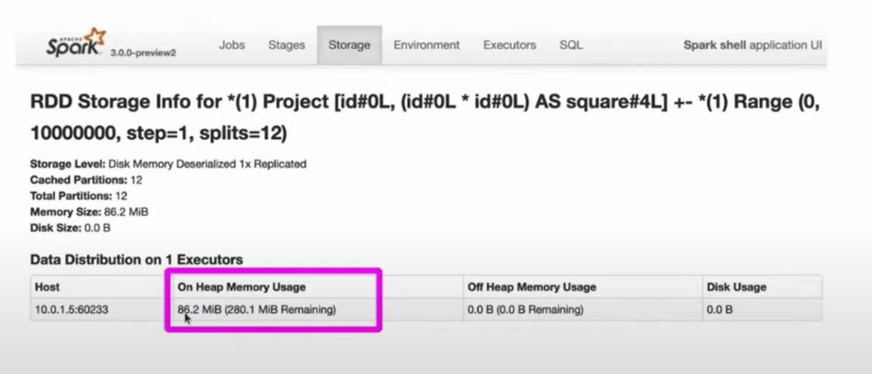
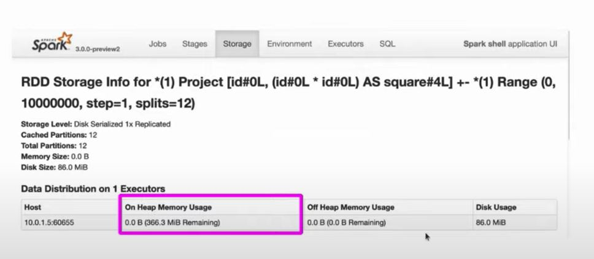

# Cache

```scala
val df = spark.range(1, * 10000000).toDF('id').withColumn("square", $"id" * $"id")
df.cache() // cache the data
df.count()  // Materialize the cache

res3: Long = 10000000
Command took 5.11 seconds

df.count() // now get it from the cache
res4: Log = 1000000
Command took 0.44 seconds
```



# Persist
```scala
// In Scala
import org.apache.spark.storage.StorageLeve

val df = spark.range(1, * 10000000).toDF('id').withColumn("square", $"id" * $"id")
df.persist(StorageLeve.DISK_ONLY) // Serialize the data an cache it on disk
df.count()  // Materialize the cache

res2: Long = 10000000
Command took 2.08 seconds

df.count() // now get it from the cache
res3: Log = 1000000
Command took 0.38 seconds
```

